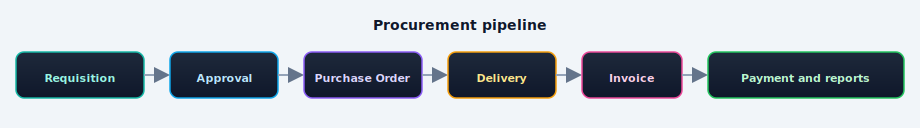
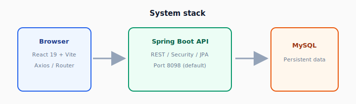
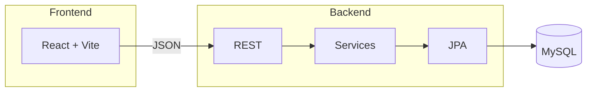
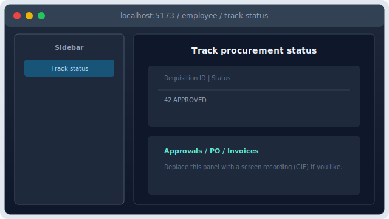

<p align="center">
  
</p>

<p align="center">
  <a href="https://react.dev/"></a>
  <a href="https://vite.dev/"></a>
  <a href="https://spring.io/projects/spring-boot"></a>
  
  <a href="https://www.mysql.com/"></a>
  
</p>

# Smart Procurement & Vendor Management System

Full-stack procurement: **requisitions**, **approvals**, **purchase orders**, **deliveries**, **invoices**, **payments**, and **reports**—with role-based UIs for employees, managers, admin, finance, and vendors.

---

## At a glance

| | |
|:---|:---|
| **Backend** | Spring Boot (REST, JPA, Security), default port **8098** |
| **Frontend** | React 19 + Vite, `VITE_API_BASE_URL` → API |
| **Database** | MySQL |
| **Layout** | Monorepo: `Smart-Procurement-Vendor-Management-System-Backend` + `Smart-Procurement-Vendor-Management-System-Frontend` |

---

## Visual workflow

<p align="center">
  
</p>

---

## Architecture

<p align="center">
  
</p>



---

## UI preview (static)

<p align="center">
  
</p>

<p align="center"><sub>Illustrative SVG mockup — not a live screenshot.</sub></p>


---

## Core flow 

1. Employee creates a **requisition**.  
2. Manager **approves**.  
3. Admin/procurement links **vendors** and **POs** to the requisition.  
4. Vendor **delivers** and **submits an invoice** against a PO.  
5. Finance **pays** and uses **reports**.  
6. Employee **tracks** status (approvals, POs, invoices, deliveries).

---

## Prerequisites

- **Java 21** (see backend `pom.xml`)  
- **Maven** or `mvnw` / `mvnw.cmd` in the backend folder  
- **Node.js 18+** and **npm**  
- **MySQL** (create DB matching your JDBC URL; default name in config is often `vender`)

---

## Configuration

**Backend** — env / `application.properties`: `SPRING_DATASOURCE_URL`, `SPRING_DATASOURCE_USERNAME`, `SPRING_DATASOURCE_PASSWORD`, `MYSQL_ROOT_PASSWORD` as needed. Default port **8098**.

**Frontend** — optional `.env`:

```env
VITE_API_BASE_URL=http://localhost:8098
```

---

## Run locally

**Backend**

```bash
cd Smart-Procurement-Vendor-Management-System-Backend
./mvnw spring-boot:run
```

Windows:

```powershell
cd Smart-Procurement-Vendor-Management-System-Backend
.\mvnw.cmd spring-boot:run
```

**Frontend**

```bash
cd Smart-Procurement-Vendor-Management-System-Frontend
npm install
npm run dev
```

Open the URL Vite prints (often `http://localhost:5173`).

---

## Build

```bash
# Backend JAR
cd Smart-Procurement-Vendor-Management-System-Backend
./mvnw clean package -DskipTests

# Frontend → dist/
cd Smart-Procurement-Vendor-Management-System-Frontend
npm run build
```

---

## API (high level)

| Area | Base path (examples) |
|------|----------------------|
| Requisitions | `/requisitions` |
| Approvals | `/approvals` |
| Purchase orders | `/po`, `/po/requisition/{id}` |
| Invoices | `/invoice`, `/invoice/requisition/{id}` |
| Deliveries | `/api/deliveries` |

Explore more under `.../controller/` in the backend.

---

## Frontend scripts

| Command | Description |
|---------|-------------|
| `npm run dev` | Dev server |
| `npm run build` | Production build |
| `npm run preview` | Preview `dist/` |
| `npm run lint` | ESLint |

---

## Troubleshooting

| Problem | Check |
|---------|--------|
| API unreachable | `VITE_API_BASE_URL`, firewall, backend on **8098** |
| DB errors | MySQL up, DB name, credentials, JDBC URL |
| CORS | Backend allows your frontend origin (e.g. `5173`) |

---

## License

MIT License

Copyright (c) 2026 

Permission is hereby granted, free of charge, to any person obtaining a copy
of this software and associated documentation files (the “Software”), to deal
in the Software without restriction, including without limitation the rights
to use, copy, modify, merge, publish, distribute, sublicense, and/or sell
copies of the Software, and to permit persons to whom the Software is
furnished to do so, subject to the following conditions:

The above copyright notice and this permission notice shall be included in all
copies or substantial portions of the Software.

THE SOFTWARE IS PROVIDED “AS IS”, WITHOUT WARRANTY OF ANY KIND, EXPRESS OR
IMPLIED, INCLUDING BUT NOT LIMITED TO THE WARRANTIES OF MERCHANTABILITY,
FITNESS FOR A PARTICULAR PURPOSE AND NONINFRINGEMENT. IN NO EVENT SHALL

---


